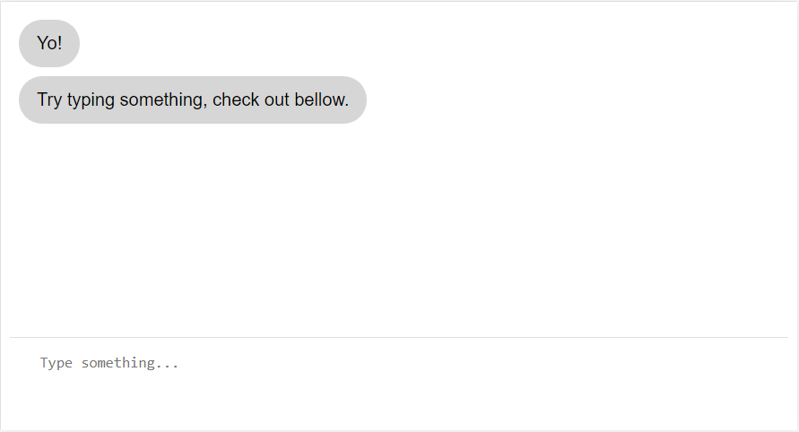

# Vue ChatUI
A Vuejs component with no external dependencies for creating conversational UIs based on 2-way chat.

## Table of contents
* [Installation](#installation)
* [Usage](#usage)
* [Support](#support)
* [Contributing](#contributing)
## Installation
## Usage
To easy access your component I recommend using the reference attribute
```html
<div id="app">
	<chatui ref="chatui"></chatui>
</div>
```
Then set your component to a variable
```javascript
// 'this' is your main Vue app
let chat = this.$refs.chatui;
```
### Adding text programatically
```javascript
//Passing a string
chat.addEntry("Hello from bot!");
//Will add a new text bubble at the left
//Passing an object
chat.addEntry( { text : "Hello from user!", user : true } );
//Will add a new text bubble at the right
```
### Enable user input
```javascript
chat.userInput("text");
```
### Using async/await
```javascript
async talk = (chat) => {
	//Use the readable promise
	await chat.addEntry("What's your name?").readable;
	let name = await chat.userInput("text");
	//userInput returns an object after the user's input is visible
	await chat.addEntry(`Nice to meet you ${name.text}`).readable;
    console.log("done");
}
```
## Support
## Contributing